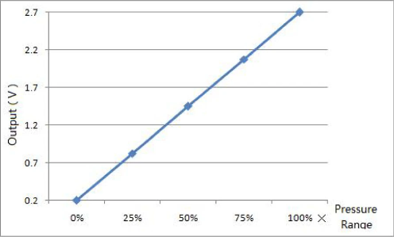

# 6874A

## 简介

气压传感器模块。

量程：`-100kPa ~ 0kPa`\
对应的电压范围：`0.2V ~ 2.7V`

`2.5V/100kPa = 25mV/kPa`.



## ADC

使用STM32自带的 12bit ADC，基准电压为`3.3V`，则分辨率为${\frac{3300mV}{2^{12}}}\approx{0.806mV}$。

### 将电压值转换为气压值

上面的曲线可以转换该函数: ${P = \frac{OUT}{25}-108}$, ${OUT}$是模块输出的模拟电压，单位$mV$。

${P = \frac{{\frac{Val_{ADC}}{4096}}\times{3300mV}}{25} - 108}$

## 程序讲解
主要函数
```c
/**
 * @brief 获取ADC当前的电压值
 * @param L[in]
 * @return 当前的电压值
 */
float get_currentVol(Prs_HandleTypeDef* L);

/**
 * @brief 获取气压值
 * @return
 */
double get_pressure();
```

### 滤波

获取电压的函数会对ADC的数值做一个简单的滤波，程序连续采样20次ADC的数值，并用冒泡排序对这一组数据进行排序，去掉最大值和最小值后对它们求平均值。
