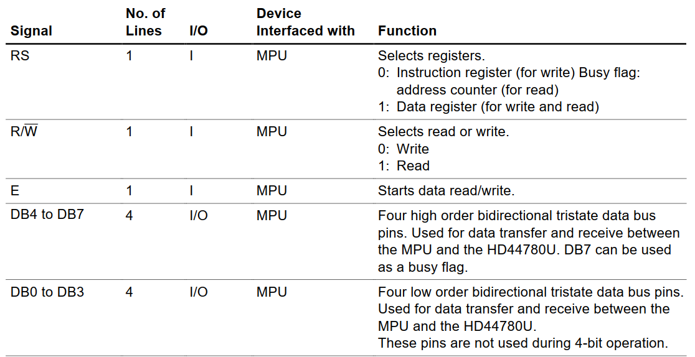

## LCD1602

LCD1602的操作可以简单的分为指令操作和数据操作（操作分为读合写），由R/S引脚来选择数据或者指令。

指令: 用来配置LCD1602的显示模式等一些设置。\
数据: 对CGRAM或者DDRAM的读写，当需要在LCD上显示字符时就需要写入DDRAM。

### 引脚定义


```text
RS:         数据/指令选择，0：指令，1：数据
R\W:        读/写选择, 0: 写，1：读
E:          写操作的情况下，高电平期间MCU将数据发送到DB端，下降沿时对数据执行相应的操作。
DB0 ~ DB7:  数据端。
```

### 硬件连接

LCD1602的接线方式有8Bit和4Bit两种。在8Bit模式中，MCU需要连接LCD的所有引脚，需要8+3总共11个GPIO。而在4Bit模式中，LCD的8根数据线只需连接高四位， 因此只需连接4+3=7个GPIO。

#### 4Bit模式
本项目，采用4Bit模式。\
在该模式中，发送到DB端的数据需要分两次发送，第一次发送高四位第二次发送低四位，其余引脚的操作与8Bit模式相同（发送时的操作也相同）。

另外，本项目还使用了IO拓展芯片，[PCF8574](/PCF8574.md)。该芯片采用I2C接口，可以拓展出8个IO口。这样只需两个GPIO就能控制LCD1602。

### tiny_lcd

```c
void lcd_sendCmd(uint8_t cmd);   // 发送指令
void lcd_sendData(uint8_t data); // 发送数据
void lcd_setCursor(uint8_t col, uint8_t row); // 设置字符显示的坐标
void lcd_print(char str[]); // 打印字符串到LCD1602
```
