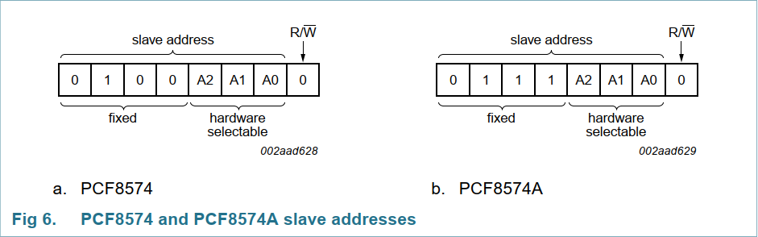
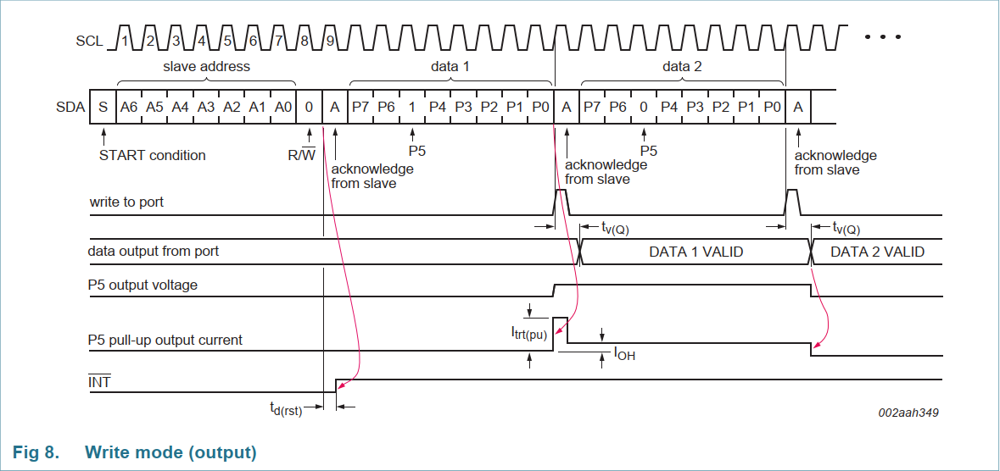

## PCF8574

该芯片有两种型号：`PCF8574A(T)`和`PCF8574(T)`，区别在于I2C地址不同。SCL时钟频率为100kHz。

### 设备地址

PCF8574采用7Bit地址模式（也就是说最后需要带上一位读写操作位），其中高四位是固定的，而这两种型号的区别就只是这四位固定的地址不同。



还有三位可编程地址，`A2~A0`，可以通过设置高低电平来配置，高电平为1，低电平为0，一般都是通过接上下拉电阻来获得高低电平。

若芯片为`PCF8574(T)`，且将`A2~A0`下拉，则从机地址为`0B0100000`即`0x20`。如果进行写操作，则加上写操作位后地址为`0B01000000`即`0x40`。

### 写入端口



只能整个端口写入，也就是一次性需要写入8个IO的电平状态。

### 硬件连接

```text
MCU I2C接口:
SDA --> PA12
SCL --> PA11

与LCD1602的连接:
P0 --> RS
P1 --> R/W
P2 --> E
P3 --> 控制背光
P4 --> DB4
P5 --> DB5
P6 --> DB6
P7 --> DB7
```

### 函数

`HAL_I2C_Master_Transmit(IIC_DEVICE, PCF8574_ADDR, (uint8_t*)DATA_BUFFER, sizeof(DATA_BUFFER), 100);`

由于只使用了`PCF8574`的写入功能，所以直接使用库函数`HAL_I2C_Master_Transmit`即可，`PCF8574_ADDR`为`PCF8574`的7Bit从机地址（地址占高七位，最低位留给库函数操作一般设置为`0`，即`PCF8574_ADDR = 0x40`）。
