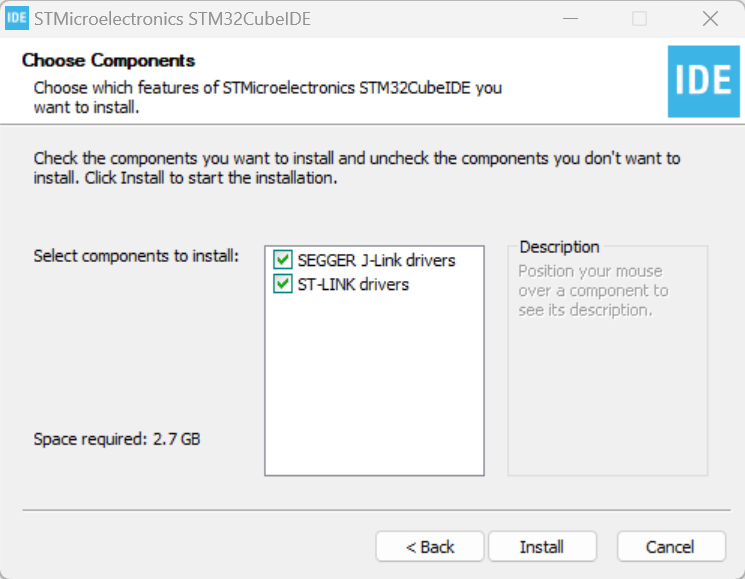
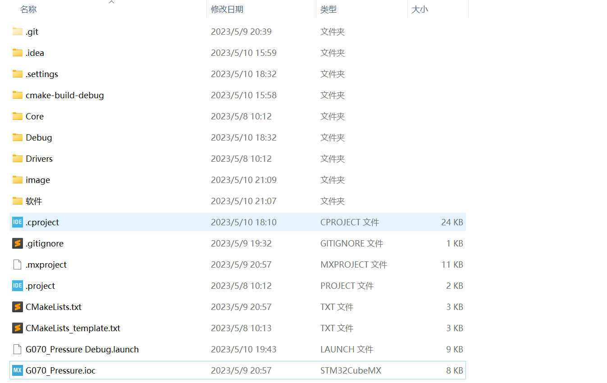

# G070_Pressure

## 打开工程

需要使用STM32 CubeIDE, 工具在:\
`.\软件\st-stm32cubeide_1.12.1_16088_20230420_1057_x86_64`

### 安装STM32 CubeIDE

双击，一直next，最后直接默认即可。


## 工程目录结构



主要的几个目录以及文件

```text
/Core:       STM32Cube MX自动生成的驱动文件，以及启动文件, 自己写的源代码文件也放在这里
/Drivers:    STM32 的标准库以及HAL库
/.project:   工程描述文件, 双击即可打开工程
```

### Core目录结构

双击`.project`文件打开工程。

```text
/Src:      存放C源文件
/Inc:      存放C头文件
/Startup/startup_stm32g070rbtx.s:  启动文件
```

在`Src\`以及`Inc\`中`it_manager`、`tiny_lcd`以及`pressuer`是自己编写的库文件。

```text
it_manager: 一些中断回调函数，以及标志位
pressure:   气压传感器的驱动函数
tiny_lcd:   lcd1602(HD44780)的驱动文件
```
