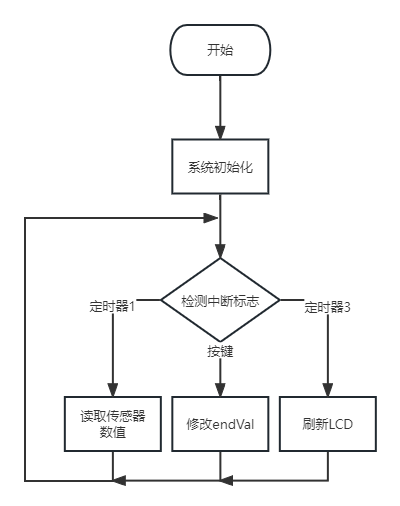
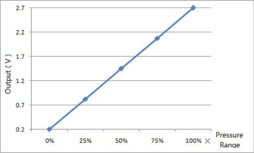
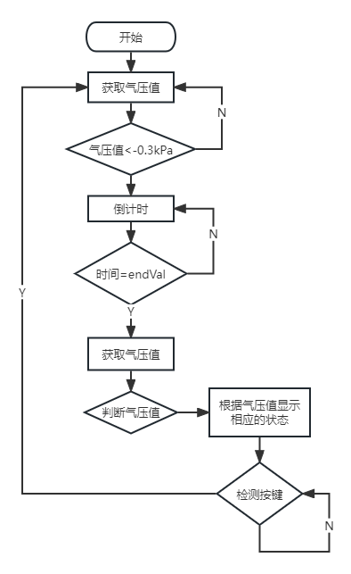

## 软件设计

### 主程序设计

&emsp;电路上电后，首先进行STM32外设的初始化。串口4用于打印程序的调试信息，
ADC1用来读取气压传感器的模拟量，并配置DMA模块来将ADC转换完成的数据传输到内存中。这样可以减轻CPU的负担，提高效率和实时性。
TIM1和TIM3设置标志位，用于读取传感器数值和刷新LCD。

&emsp;在初始化完成后，程序进入主循环，等待按键输入或者定时器中断。
如果按键被按下，程序会根据按键次数来增加或减少倒计时的时间，最大为15秒，最小为5秒。
如果定时器1中断发生，程序会读取ADC1的数据，并通过一个简单的滤波算法来去除噪声。
如果定时器3中断发生，程序会刷新LCD上的气压显示。

### 气压读取软件设计

气压传感器输出的模拟量跟气压的关系是线性的，所以可以将输出曲线的转换成一个线性函数。
这个线性函数的一般形式是y=ax+b，其中y是输出模拟量，x是气压，a和b是常数。
传感器的数据手册直接给出了曲线，直接将该曲线转换成函数，
${P = \frac{{\frac{Val_{ADC}}{4096}}\times{3300mV}}{25} - 108}$
这样，我们就可以根据输出模拟量反推出气压的大小，从而实现气压的测量。

采集到数值后，还需要进行滤波，程序连续采样20次ADC的数值，并用冒泡排序对这一组数据进行排序，去掉最大值和最小值后对它们求平均值。

### 肌肉状态检测软件设计

&emsp;使用STM32的ADC持续采集气压传感器输出的模拟量，当数值超过阈值时，开启倒计时，等待气压值稳定。
倒计时结束后，再次读取气压值，通过这个数值来判断肌肉的状态。
当气压值小于-6.5kPa时，肌肉为放松状态；
当气压值大于-6.5kPa且小于-4.5kPa时，肌肉为正常状态；
当气压值大于-4.5kPa且小于-2kPa时，肌肉为紧张状态；
其余的气压值为无效值，状态显示 error 需要重新测量。

